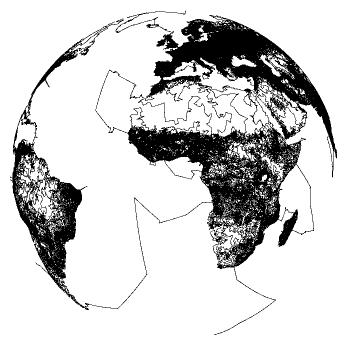

# Traveling Salesman Problem

The travelling salesman problem (TSP) asks the following question: "Given a list of cities and the distances between each pair of cities, what is the shortest possible route that visits each city and returns to the origin city?" It is an NP-hard problem in combinatorial optimization, important in operations research and theoretical computer science.

The travelling purchaser problem and the vehicle routing problem are both generalizations of TSP.

In the theory of computational complexity, the decision version of the TSP (where, given a length L, the task is to decide whether the graph has any tour shorter than L) belongs to the class of NP-complete problems. Thus, it is possible that the worst-case running time for any algorithm for the TSP increases superpolynomially (but no more than exponentially) with the number of cities.


The problem was first formulated in 1930 and is one of the most intensively studied problems in optimization. It is used as a benchmark for many optimization methods. Even though the problem is computationally difficult, a large number of heuristics and exact algorithms are known, so that some instances with tens of thousands of cities can be solved completely and even problems with millions of cities can be approximated within a small fraction of 1%.[1]

The TSP has several applications even in its purest formulation, such as planning, logistics, and the manufacture of microchips. Slightly modified, it appears as a sub-problem in many areas, such as DNA sequencing. In these applications, the concept city represents, for example, customers, soldering points, or DNA fragments, and the concept distance represents travelling times or cost, or a similarity measure between DNA fragments. The TSP also appears in astronomy, as astronomers observing many sources will want to minimize the time spent moving the telescope between the sources. In many applications, additional constraints such as limited resources or time windows may be imposed .

The best reported tour for the World TSP was found by by Keld Helsgaun using a variant of his LKH heuristic algorithm. The tour of length 7,515,772,107 was found on March 13, 2018

# XEL Soliution 




 * Name:		Travelling Salesman Problem 
 * Diminsions:	2 mil x 2 mil
 * Weight Type:	ATT - Pseudo-Euclidean distance
 * Algorithm:	Brute Force

 # Memory Map
 *   Round Number:         x
 *   Random Input:         x
 *   Cost Matrix Vars:		 x
 *   X Dist & Y Dist:		   x
 *   Distance Point A to B x
 *   Algorithm Variables:	 x
 *   Calculated Distance:	 x
 *   Loop Counters:			   x
 *   Path Data:   			   x
 *   Cost Matrix:          x 	

we will try to use decentralised computing engine to solve this problem .

# Source 

http://www.math.uwaterloo.ca/tsp/world/

# Raw file for cities 

http://www.math.uwaterloo.ca/tsp/world/world.tsp.gz (Gzipped TSPLIB Format, world.tsp.gz, 11.5 mbytes) 

# Special thanks

https://github.com/any1dot

for helping with sorting out raw data . 

https://github.com/tieandsuit/walking-problem-/blob/master/Main.java

```java
import java.io.File;
import java.util.Scanner;

public class Main {

    public static void main(String[] args) throws  Exception {

        File file = new File("input.txt");
        Scanner input = new Scanner(file);

        int i = 100;
        while(input.hasNext()) {
            try
            {
                String nextLine = input.nextLine();
                String[] fields = nextLine.split(" ");
                System.out.println("u["+i+"] = " + fields[1] + ";");
                i++;
                System.out.println("u["+i+"] = " + fields[2] + ";");
                i++;
            }
            catch(Exception e)
            {

            }

        }
        input.close();
    }
}
```
# It's not usable at this stage . Please wait for update .

